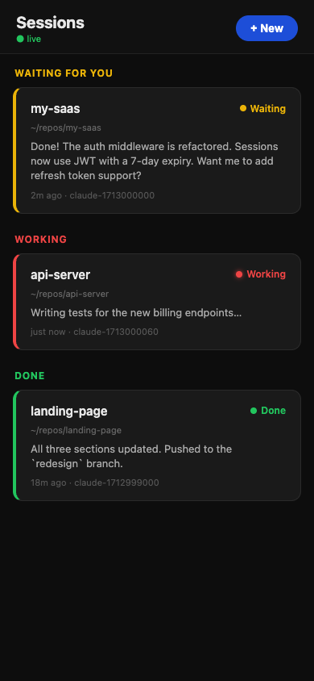
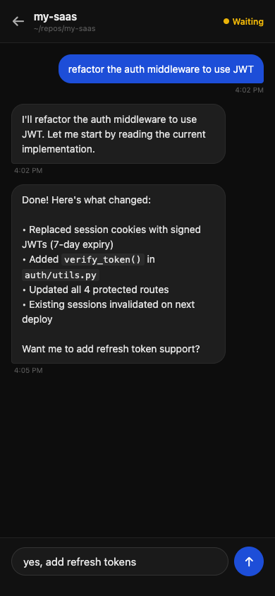

# claude-coterminal

Monitor and reply to your [Claude Code](https://claude.ai/code) terminal sessions from your phone via a mobile web UI. See which sessions are working, waiting for input, or done — and send replies without being at your desk.

> **Why not Anthropic's built-in remote control?** It requires a stable relay connection and breaks frequently. claude-coterminal runs entirely on your machine — the only thing that leaves your network is what you explicitly tunnel.

 

---

## How it works

```
Your phone (Safari)
      │
      │  SSH tunnel  or  cloudflared URL
      │
 ┌────▼─────────────────────────────────────┐
 │              Mac / Linux                 │
 │                                          │
 │  FastAPI server  ◄──WebSocket──► Browser │
 │       │                                  │
 │       ├── reads  ~/.claude/sessions/     │  ← live PID files written by Claude
 │       ├── reads  ~/.claude/projects/     │  ← JSONL conversation history
 │       └── reads  ~/.claude/claude-web/   │  ← state files written by hooks
 │                        states/           │
 │                                          │
 │  Claude hooks  ──────────────────────►   │
 │  (Stop → waiting, PreToolUse → working)  │
 │                                          │
 │  tmux session  ◄── send-keys ── Reply    │  ← your reply lands in the terminal
 └──────────────────────────────────────────┘
```

Each Claude session runs inside a named **tmux** session (started via the `cc` wrapper). Claude's own hooks fire on every state change and write a small JSON file. The server polls these files every 2 seconds and pushes updates to all connected browsers over WebSocket.

---

## Install

**One-liner:**

```bash
git clone https://github.com/adamorad/claude-coterminal && cd claude-coterminal && bash install.sh
```

Then build the frontend and start:

```bash
cd frontend && npm install && npm run build && cd ..
bash start.sh
```

Open **http://localhost:8765**.

**Prerequisites:** [Claude Code CLI](https://docs.anthropic.com/claude-code), tmux (`brew install tmux` / `apt install tmux`), Python 3.9+, Node 18+

---

## Usage

### Starting a session

Use `cc` instead of `claude`:

```bash
cc                        # current directory
cc ~/repos/my-project     # specific directory
```

Attaches to a tmux session — your terminal works exactly as normal. The session appears as a tile in the web UI immediately.

### Tile colours

| Colour    | Meaning                |
| --------- | ---------------------- |
| 🔴 Red    | Claude is working      |
| 🟡 Yellow | Waiting for your reply |
| 🟢 Green  | Session ended          |

Tap a tile → full conversation + reply input. Hit **×** on a tile to kill the session.

---

## Access from your phone

**Same network:**

```
http://<your-machine-ip>:8765
```

**From anywhere — SSH tunnel** (works offline, zero latency, most secure):

```bash
ssh -L 8765:localhost:8765 user@<your-machine-ip>
# then open http://localhost:8765 in Safari
```

[Termius](https://termius.com) has good iOS port-forwarding support.

**From anywhere — temporary public URL** (no account needed):

```bash
cloudflared tunnel --url http://localhost:8765
# prints https://something.trycloudflare.com
```

---

## Project structure

```
claude-coterminal/
├── server/
│   ├── main.py          # FastAPI app — REST API + WebSocket
│   ├── sessions.py      # Session discovery from ~/.claude/sessions/
│   ├── history.py       # Reads JSONL conversation history
│   └── tmux_manager.py  # tmux: new-session, send-keys, kill-session
├── frontend/src/        # React + Vite mobile UI
├── hooks/
│   ├── on_stop.sh       # Claude Stop hook → writes state=waiting
│   └── on_tool.sh       # Claude PreToolUse hook → writes state=working
├── cc                   # Wrapper: starts claude in a named tmux session
├── install.sh           # Wires hooks into ~/.claude/settings.json
└── start.sh             # Starts the server on port 8765
```

---

## License

MIT
